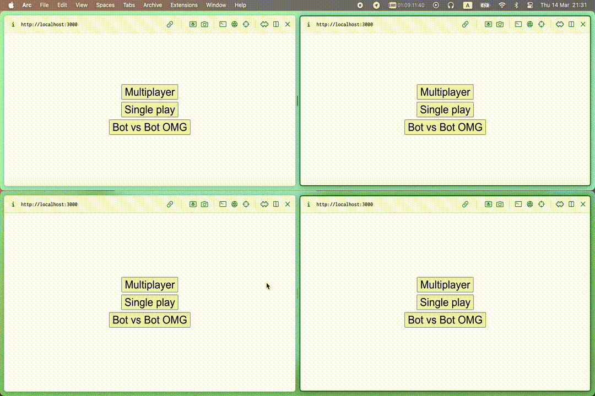
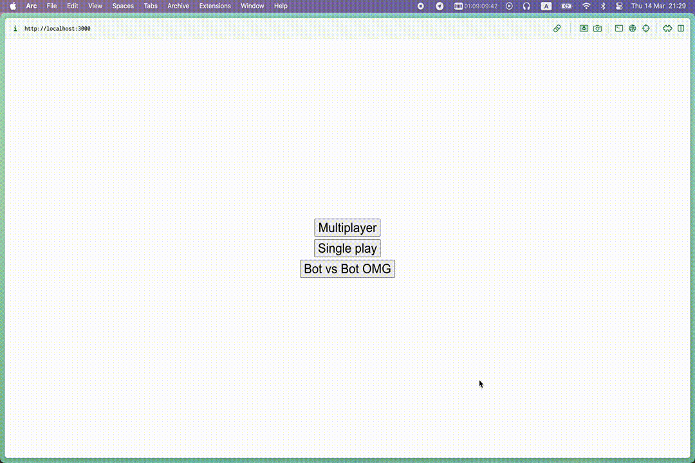
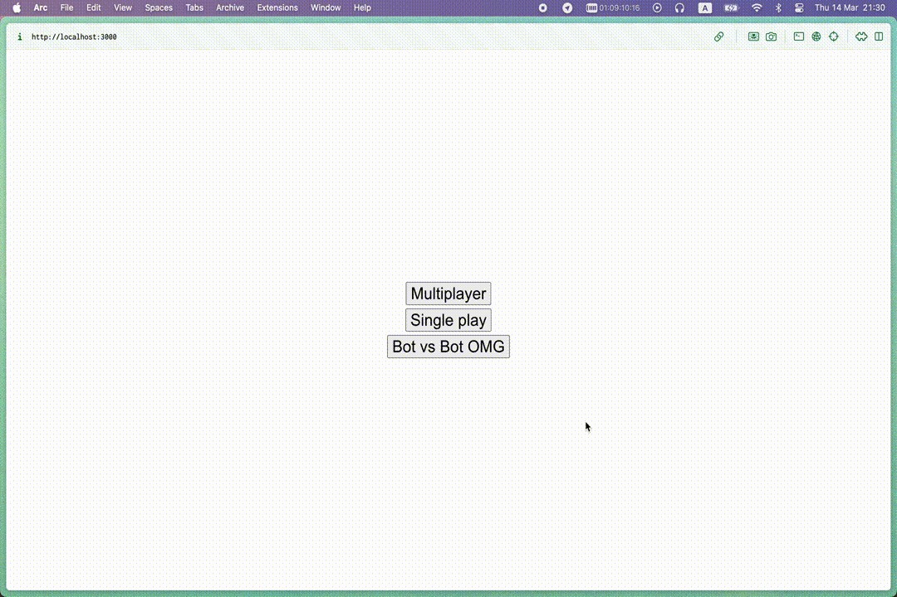

## Это readme к третьему дз!

#### Я выполнил его на автомат, а именно:
- Реализовал мультиплейер на разных устройствах, игру против бота, а так же сражение двух ботов)
- Генерация поля происходит в ts, не html

Использовал:
- React
- TypeScript
- WebSockets

#### • Реализовал сервер на Golang, являющийся оператором между играми, поддерживающий сколь угодное их количество. 

##### В его реализацию входит: 
- Соединение с клиентом через веб-сокеты
- Поддержка нескольких игр, их количество хардкодится, по дефолту их 10, при превышении количества на клиент отправится соответвтуещее предупреждение
- Оповещение клиентов о происходящих событиях: подключении оппонента, изменениях на доске, выходе соперника и окончании игры
- Логирование происходящие изменения

#### Теперь о клиенте:
- Во-первых, все реализовано на реакте, во-вторых, я использовал реакт и ts
- Игра с ботом:
 Дефолтная игра против бота, для реализации выбора им ходов я использовал алгоритм [minimax](https://www.neverstopbuilding.com/blog/minimax), слегка его даунгрейднул, чтобы можно было выиграть (но не сильно)
- Два бота - шанс понаблюдать за уникальной схваткой двух алгоритмов, упомянутых выше. Так как моя реализация использует интерфейсы, то сделать подобный вариант игры не составило проблем.
- И, наконец, мультиплейер. Игра проходит таким образом: пользователь вводит свое имя, которое сохраняется все время работы в меню мультиплейерной игры с помощью хуков. Игрок нажимает "создать игру", этот запрос отправляется на сервер, в виде ответа возвращается код приглашения, который вводит другой пользователь, код отправляется на сервер, где в структуре комнаты хранятся два веб-сокета игроков. Когда второй игрок заходит в комнату, хосту отправляется уведомление. У обоих пользователей открывается игровое поле. Далее происходит обмен сообщениями с изменениями на поле и передачей хода оппоненту. Так же я сделал уведомление пользователя в случае выхода оппонента. 

### Работа клиента:

#### Мультиплейер

#### Игра с ботом

#### Сражение роботов

